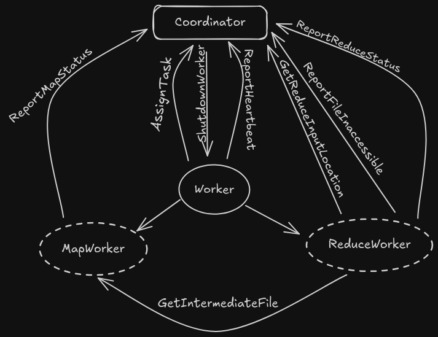

# MapReduce Implementation in Go

This repository contains a basic implementation of the MapReduce programming model in Go. It's designed to be a learning tool and a starting point for building more complex distributed data processing systems.

## Overview

MapReduce is a programming model and an associated implementation for processing and generating large datasets.  Programs written in the MapReduce style are automatically parallelized and executed on a cluster of machines.

This implementation includes:

*   A coordinator process that assigns tasks to workers and manages the overall execution.
*   Worker processes that execute map and reduce tasks.
*   Basic fault tolerance mechanisms (worker failure detection and task reassignment).

## Getting Started

### Installation

Clone the repository:

    ```bash
    git clone github.com/Binit-Dhakal/mapreduce
    cd mapreduce
    ```


### Running the Example

1.  Prepare your input files.  Place them in a directory.  For example, you can use the provided text files in the `txt/` directory.

2.  Run the coordinator:

    ```bash
     make run-coordinator
    ```

3.  Run one or more workers in separate terminals:

    ```bash
    make
    ```

    The workers will register with the coordinator and begin processing tasks.

4.  The results will be written to files named `reducer_*` in the current directory.

## Code Structure

*   `mr/coordinator.go`:  Implements the coordinator process, responsible for task assignment, fault tolerance, and overall job management.
*   `mr/worker.go`: Implements the worker process, which executes map and reduce functions.
*   `mr/rpc.go`: Defines the RPC (Remote Procedure Call) interfaces used for communication between the coordinator and workers.
*   `mr/mapworker.go`: Implements the map worker process, which executes map functions.
*   `mr/reduceworker.go`: Implements the reduce worker process, which executes reduce functions.
*   `txt/*.txt`: Example input text files.


## Architectural Decisions

This project's MapReduce implementation prioritizes **correctness, fault tolerance, and efficiency** through key architectural choices:


* **Phased Execution Model:**
    * Strict sequential phases (**Map $\rightarrow$ Shuffle & Sort $\rightarrow$ Reduce**) ensure data consistency and correctness by guaranteeing all intermediate data is present before reduction.
* **Centralized Coordinator:**
    * A single Coordinator manages all task scheduling, progress monitoring, and fault handling. This design simplifies implementation but presents a potential bottleneck for very large clusters (a consideration for future distributed coordinator designs).
* **Intermediate Data Persistence:**
    * Intermediate data (Map phase output) is stored in files on the local disks of the Map Workers. This robust approach is simple, though network bandwidth and very large intermediate data could be areas for future optimization (e.g., in-memory shuffling).
* **Robust Fault Tolerance:**
    * **Worker Liveness:** Leverages **worker-initiated heartbeats** for scalable and timely detection of node failures.
    * **Task Recovery:**
        * **Map Tasks:** Coordinator-managed **timeouts** trigger re-execution of failed or unresponsive Map tasks.
        * **Reduce Tasks (Shuffle Phase):** Reduce Workers employ **intelligent retry logic**: they report upstream Map Worker failures, continue fetching from healthy sources, and **periodically re-poll the Coordinator for updated intermediate file locations** (new worker addresses for re-executed Map tasks). This strategy avoids "thundering herd" issues and ensures resilient data collection.
* **Efficient Shuffle & Sort:**
    * Implemented via **external merge sort** using a **min-heap**. This method is highly memory-efficient, requiring only `O(log N)` memory (where $N$ is map tasks) as it doesn't load all data into RAM. It leverages pre-sorting by Map tasks.
* **Inter-component Communication:**
    * All communication between the Coordinator and Workers uses **Go's built-in RPC package** for clear and robust interaction.

These design decisions collectively contribute to a reliable, scalable, and performant distributed data processing system.

## Future Work

*   Implement a distributed coordinator for better scalability and fault tolerance.
